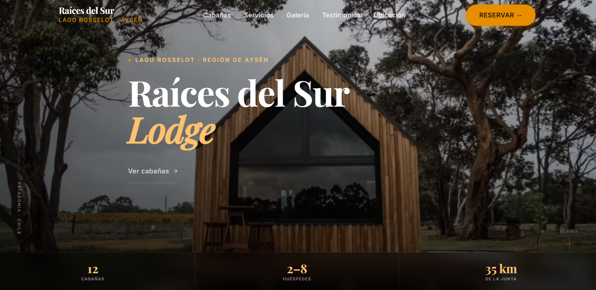

# Raíces del Sur Lodge 🌲

Una moderna y elegante aplicación web para reservas de cabañas de lujo (Lodge) ubicada en la Patagonia Chilena, a orillas del majestuoso Lago Rosselot en la Región de Aysén.

## 🚀 Vista Previa

El sitio está diseñado con un enfoque "Mobile First" y una estética minimalista premium, ofreciendo animaciones fluidas de entrada, transiciones armónicas y un Hero dinámico que resalta la belleza del entorno natural.

## 🛠️ Stack Tecnológico

Este proyecto ha sido desarrollado utilizando herramientas modernas y optimizadas para un alto rendimiento:

- **Frontend Core:** [React 18](https://react.dev/)
- **Lenguaje:** [TypeScript](https://www.typescriptlang.org/) para un tipado estricto y seguro.
- **Build Tool:** [Vite](https://vitejs.dev/) para un desarrollo ultrarrápido y construcción optimizada.
- **Estilos:** CSS3 Moderno (Variables, Flexbox, Grid) sin frameworks pesados, garantizando máxima personalización y ligereza.
- **Animaciones:** Intersection Observer API & MutationObserver nativos para "Scroll Reveal" y transiciones CSS puras.
- **Imágenes:** Formato de alta eficiencia `.avif` y carga diferida (`lazy loading`) nativa.

## 📂 Características Principales

1.  **Diseño Responsivo:** Adaptabilidad perfecta desde dispositivos móviles hasta pantallas 4K.
2.  **Rendimiento Extraordinario:** Carga inicial rápida, componentes renderizados dinámicamente, y uso inteligente de la caché.
3.  **Hero Dinámico:** Imágenes de alta calidad en rotación automática mediante un sistema de fundido cruzado (crossfade) de doble capa, optimizado para no usar CPU extra.
4.  **SEO y OpenGraph Óptimos:** Listo para ser compartido en redes sociales y posicionado en buscadores de forma efectiva.

## 👨‍💻 Autor

Desarrollado por **JavGarin**.

